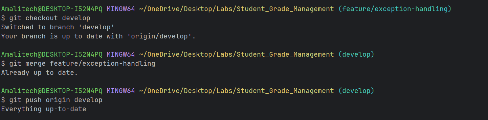

---
# 📘 Student Grade Management System Lab Assignment.

A comprehensive Java-based student grade management system with advanced features including exception handling, reporting, and bulk imports.

---

## 📌 Features

### ✔ Student Management

* Add Regular and Honors students
* Auto-generated student IDs (STU001, STU002, …)
* View all students with type, average grade, and status
* Honors students show eligibility (average ≥ 85%)

### ✔ Grade Management

* Record grades for Core and Elective subjects
* Grade validation (0–100)
* Auto-generated grade IDs (GRD001, GRD002, …)
* View grade report for any student
* Displays grades in a table
* Calculates:

  * Core Average
  * Elective Average
  * Overall Average

## Features

- Student Management (Regular and Honors students)
- Grade Recording and Tracking
- Grade Report Generation (Summary and Detailed)
- Bulk CSV Import
- GPA Calculation
- Class Statistics
- Advanced Search Functionality

## Setup Instructions

1. Clone the repository
2. Ensure Java JDK 8+ is installed
3. Compile: `javac *.java`
4. Run: `java Main`

---

## 🧪 Test Scenarios (from assignment)

### 1️⃣ View Students

* Displays 5 pre-loaded students
* Shows type, passing grade, and eligibility

### 2️⃣ Add Student

* Add Regular or Honors student
* Generates unique ID
* Status = "Active"

### 3️⃣ Record Grade

* Select subject type & subject
* Enter grade (0–100)
* Confirms before saving

### 4️⃣ View Grade Report

* Grades shown in table
* Shows averages & summary
* Handles “no grades” case

### 5️⃣ Menu Navigation

* Loops until exit
* Handles invalid input

## Testing

Run tests with JUnit 5.

---

## 🧠 OOP Principles Used

### ✔ **Abstraction**

* `Student` and `Subject` are abstract classes
* Define shared properties and behaviors

### ✔ **Inheritance**

* `RegularStudent` and `HonorsStudent` extend `Student`
* `CoreSubject` and `ElectiveSubject` extend `Subject`

### ✔ **Polymorphism**

* `displayStudentDetails()` overridden in subclasses
* One method call, different behavior based on type

### ✔ **Interfaces**

* `Gradable` defines grade behaviors

### ✔ **Composition**

* StudentManager contains `Student[]`
* GradeManager contains `Grade[]`

### ✔ **Encapsulation**

* Private fields with getters/setters

---

## 📝Screenshots of pull requests

---

## 🙋‍♂️ Author
**Bruce Mutsinzi** 
---
